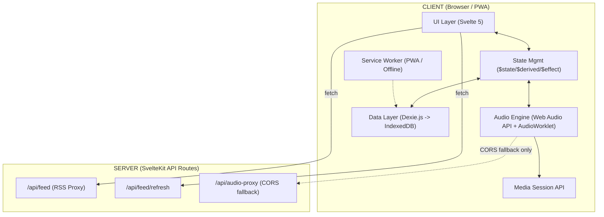
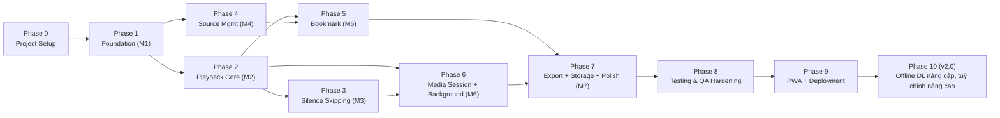

# Master Plan

# Distraction-Free Audio Learning Player (FocusCast)

## Version 1.1

> **Tài liệu tham chiếu:**
>
> - [Problem_Definition_v1.0.md](file:///Users/thinhquoc/Desktop/Persional/podcast-player/docs/Problem_Definition_v1.0.md)
> - [Business_Rules_v1.1.md](file:///Users/thinhquoc/Desktop/Persional/podcast-player/docs/Business_Rules_v1.1.md)
> - [PRD_v1.0.md](file:///Users/thinhquoc/Desktop/Persional/podcast-player/docs/PRD_v1.0.md)
> - [SDD_v1.1.md](file:///Users/thinhquoc/Desktop/Persional/podcast-player/docs/SDD_v1.1.md)
> - [Tech_Spec_v1.1.md](file:///Users/thinhquoc/Desktop/Persional/podcast-player/docs/Tech_Spec_v1.1.md)

> **Changelog:**
>
> - **v1.1** (2026-07-23): Bổ sung chính sách Git Hooks (Husky + lint-staged + pre-commit/pre-push), quy tắc bắt buộc **Test-alongside Development** (mỗi function mới phải có unit test kèm theo, mỗi Feature hoàn thành phải có unit test bao phủ). Đồng bộ version với Tech-Spec v1.1 và SDD v1.1.
> - **v1.0** (2026-07-23): Bản khởi tạo — tổng hợp từ Problem Definition, Business Rules v1.1, PRD v1.0, SDD v1.0, Tech-Spec v1.0.

> **Mục đích:** Đây là tài liệu điều phối tổng thể (single source of truth cho execution), tổng hợp toàn bộ 4 tài liệu trên thành một **kế hoạch triển khai theo Phase/Milestone**, có traceability đầy đủ tới Business Rules (BR-*) và Feature (F0x), kèm checklist thực thi, exit criteria, rủi ro và Definition of Done. Dùng tài liệu này làm nguồn theo dõi tiến độ khi implement.

---

# 1. Tóm tắt dự án (Executive Summary)

| Thuộc tính              | Giá trị                                                                                                                                          |
| ----------------------- | ------------------------------------------------------------------------------------------------------------------------------------------------ |
| **Tên sản phẩm**        | Distraction-Free Audio Learning Player (nội bộ: FocusCast)                                                                                       |
| **Loại sản phẩm**       | Web App / PWA — Local-First                                                                                                                      |
| **Đối tượng**           | Knowledge Learner nghe Podcast/Audiobook khi multitasking                                                                                        |
| **Triết lý cốt lõi**    | Active Learning Engine — nghe tập trung, không quảng cáo, bắt ý tưởng tức thì                                                                    |
| **Không giải quyết**    | Discovery nội dung, Cloud Sync, Social, AI Summary/STT, Hosting audio                                                                            |
| **Stack chính**         | SvelteKit 2.x + Svelte 5 (Runes) + TypeScript, Dexie.js (IndexedDB), Web Audio API (AudioWorklet), rss-parser (server-side), @vite-pwa/sveltekit |
| **Kiến trúc**           | Feature-Based Clean Architecture (Playback / Bookmark / Library / Settings / Core)                                                               |
| **Nguyên tắc bất biến** | 100% Local-First (BR-DAT-001), Ad-free by design (BR-PB-006), Timestamp luôn tham chiếu audio gốc (BR-SS-004)                                    |

---

# 2. Nguyên tắc chỉ đạo triển khai (Guiding Principles)

Mọi quyết định kỹ thuật trong quá trình build PHẢI tuân thủ các nguyên tắc sau (không được vi phạm dù dưới áp lực tiến độ):

1. **Local-First tuyệt đối** — không có API nào gửi dữ liệu người dùng (bookmark, note, danh sách nghe) ra ngoài. Chỉ RSS proxy (server-side) và audio fetch được phép, và cả hai đều không lưu trữ dữ liệu người dùng.
2. **Ad-free by design** — không tích hợp bất kỳ SDK quảng cáo/analytics bên thứ ba nào.
3. **Timestamp gốc bất biến** — mọi module (Silence Skipping, Speed Control, Bookmark) phải thao tác trên/tham chiếu timestamp của audio gốc, không phải audio đã xử lý.
4. **Non-destructive Bookmark** — Bookmark/Note không bao giờ bị auto-cleanup xóa (BR-DAT-004), kể cả khi Track bị xóa (`ORPHAN_PRESERVE`, BR-BM-005).
5. **Progressive enhancement cho Silence Skipping** — nếu AudioWorklet/Web Audio API không khả dụng (đặc biệt iOS Safari background), hệ thống phải fallback êm ái sang HTML5 `<audio>` thay vì crash.
6. **Feature-based module boundary** — code luôn được đặt trong đúng feature slice (`playback`, `bookmark`, `library`, `settings`, `core`), tránh cross-import không qua `index.ts` (barrel) của feature.
7. **Test-alongside Development (bắt buộc)** — mọi function/module mới có logic nghiệp vụ PHẢI có ít nhất 1 unit test viết kèm ngay trong cùng commit/PR, không hoãn lại. Một Feature chỉ được coi là hoàn thành khi có unit test bao phủ các luồng chính. Git Hook (Husky) chặn commit/push nếu lint hoặc test thất bại (chi tiết tại §2.1).

## 2.1 Chính sách Testing & Git Hooks (Quality Gate)

Để nguyên tắc #7 được thực thi tự động thay vì phụ thuộc kỷ luật cá nhân, dự án áp dụng bộ công cụ sau:

| Công cụ         | Vai trò                                                                                   |
| --------------- | ----------------------------------------------------------------------------------------- |
| **ESLint**      | Phát hiện lỗi code style/logic tĩnh (TypeScript + Svelte-aware).                          |
| **Prettier**    | Format code nhất quán (`.ts`, `.svelte`, `.css`, `.json`).                                |
| **Husky**       | Quản lý Git Hooks (`pre-commit`, `pre-push`) tại `.husky/`.                               |
| **lint-staged** | Chỉ chạy lint/format/test trên các file đã staged — giữ commit nhanh.                     |
| **Vitest**      | Chạy unit test liên quan tới file staged (`pre-commit`) và toàn bộ suite (`pre-push`/CI). |

**Quy tắc bắt buộc:**

1. **Test-alongside theo hàm:** Mỗi khi tạo mới một function/method có logic nghiệp vụ (không tính getter/setter đơn thuần hay markup UI thuần), PHẢI viết kèm ít nhất 1 unit test trong cùng commit/PR. Không để lại "TODO: viết test sau".
2. **Test theo Feature:** Một Feature (F0x, xem Section 4) chỉ được đánh dấu **Done** khi có bộ unit test bao phủ toàn bộ Business Rules liên quan (Traceability Matrix, Section 4) và test suite pass.
3. **Pre-commit Gate:** `.husky/pre-commit` chạy `lint-staged` → tự động `eslint --fix` + `prettier --write` + chạy test liên quan tới file thay đổi. Commit bị từ chối nếu lint không tự fix được hoặc test fail.
4. **Pre-push Gate (khuyến nghị):** `.husky/pre-push` chạy toàn bộ `npm run test:unit` để bắt lỗi test chéo module trước khi đẩy code lên remote.
5. **Không bypass hook** bằng `git commit --no-verify` trừ trường hợp khẩn cấp đã được xác nhận rõ ràng.
6. **CI song song:** Dù đã có Git hook cục bộ, CI (Phase 8) vẫn chạy lại toàn bộ lint + test để tránh rủi ro hook bị bỏ qua trên máy dev.

Chi tiết cấu hình kỹ thuật (`.husky/pre-commit`, `lint-staged` config, `package.json` scripts): xem [Tech_Spec_v1.1.md](file:///Users/thinhquoc/Desktop/Persional/podcast-player/docs/Tech_Spec_v1.1.md) §3.4.

---

# 3. Kiến trúc tổng thể (tóm tắt điều phối)



Chi tiết đầy đủ: xem [SDD_v1.1.md](file:///Users/thinhquoc/Desktop/Persional/podcast-player/docs/SDD_v1.1.md) §1 (kiến trúc), §2 (module spec), §5 (data flow) và [Tech_Spec_v1.1.md](file:///Users/thinhquoc/Desktop/Persional/podcast-player/docs/Tech_Spec_v1.1.md) §2 (project structure), §5 (AudioWorklet), §3.4 (Git Hooks & Quality Gate).

---

# 4. Traceability Matrix — Feature ↔ Business Rules ↔ Module

| Feature | Tên                         | Priority | BR liên quan             | Module (Tech-Spec)                                                 |
| ------- | --------------------------- | -------- | ------------------------ | ------------------------------------------------------------------ |
| F01     | RSS Feed Source             | P0       | BR-SRC-001, 003, 004     | `features/library`, `routes/api/feed`                              |
| F02     | Local File Import           | P0       | BR-SRC-002, 003          | `features/library`                                                 |
| F03     | Offline Download            | P1       | BR-SRC-005               | `features/library/infrastructure/offline-service.ts`               |
| F04     | Playback Core Controls      | P0       | BR-PB-001 → 006          | `features/playback`                                                |
| F05     | Silence Skipping            | P0       | BR-SS-001 → 004          | `features/playback/infrastructure/engine.svelte.ts` + AudioWorklet |
| F06     | Quick Bookmark              | P0       | BR-BM-001, 002, 003, 007 | `features/bookmark`                                                |
| F07     | Bookmark Management         | P0       | BR-BM-004, 005, 006      | `features/bookmark`                                                |
| F08     | Export Notes                | P0       | BR-EXP-001 → 003         | `features/bookmark/infrastructure/export-service.ts`               |
| F09     | Media Session Integration   | P0       | BR-MS-001, 002, 003      | `features/playback/infrastructure/media-session.ts`                |
| F10     | Background Audio & Fallback | P0       | BR-XD-001                | `features/playback/infrastructure/fallback.ts`                     |
| F11     | Data Storage & Management   | P0       | BR-DAT-001 → 004         | `core/db`, `features/settings`                                     |

> Ghi chú: BR-EXP-* và BR-XD-* không được trích trong bản Business_Rules_v1.1.md đã đọc đầy đủ ở phần đầu (chỉ đọc tới BR-MS-001); PRD/SDD tham chiếu các mã này cho Export và Cross-cutting (performance/background). Khi implement, đối chiếu lại đầy đủ Business_Rules_v1.1.md §8/§9 (Export, Cross-cutting) trước khi code F08/F09/F10 để đảm bảo không lệch rule.

---

# 5. Lộ trình theo Phase (Roadmap)

Lộ trình bám sát PRD §10 (M1 → M7) nhưng chi tiết hóa thành các Phase có exit criteria rõ ràng. Thứ tự phản ánh **dependency kỹ thuật thực tế**, không phải mốc thời gian.



---

## Phase 0 — Project Setup & Tooling

**Mục tiêu:** Có project SvelteKit chạy được, cấu hình đầy đủ tooling trước khi viết feature code.

**Checklist:**

- [ ] Khởi tạo project: `npx sv create` (SvelteKit 2.x + Svelte 5 + TypeScript).
- [ ] Cài `@sveltejs/adapter-node` (theo Tech-Spec §1.2.1, không dùng `adapter-static`).
- [ ] Cài dependencies production: `dexie`, `rss-parser`, `uuid`.
- [ ] Cài dev dependencies: `vitest`, `@playwright/test`, `fake-indexeddb`, `msw`, `eslint`, `prettier`, `prettier-plugin-svelte`, `@vite-pwa/sveltekit`, `husky`, `lint-staged`.
- [ ] Thiết lập ESLint + Prettier config (Svelte-aware).
- [ ] Khởi tạo Husky: `npx husky init` → tạo `.husky/pre-commit`.
- [ ] Cấu hình `lint-staged` (trong `package.json` hoặc `.lintstagedrc.json`): chạy `eslint --fix` + `prettier --write` + `vitest related --run` trên các file `.ts`/`.svelte`/`.js` đã staged.
- [ ] `.husky/pre-commit` gọi `npx lint-staged` — chặn commit nếu lint/format không tự sửa được hoặc test liên quan fail.
- [ ] (Khuyến nghị) `.husky/pre-push` chạy `npm run test:unit` — chặn push nếu bất kỳ unit test nào fail.
- [ ] Thêm script `package.json`: `"prepare": "husky"`, `"lint": "eslint ."`, `"format": "prettier --write ."`, `"test:unit": "vitest run"`, `"test:e2e": "playwright test"`.
- [ ] Tạo cấu trúc thư mục đầy đủ theo Tech-Spec §2.1 (`src/lib/core`, `src/lib/features/{playback,bookmark,library,settings}`, `src/routes`, `static`, `tests/unit`, `tests/e2e`).
- [ ] Cấu hình `tsconfig.json` strict mode.
- [ ] Thiết lập `vite.config.ts` khung (chưa cần PWA plugin đầy đủ — thêm ở Phase 9).
- [ ] Thiết lập CSS foundation: `global.css`, `typography.css`, `themes.css`, `components.css` (Vanilla CSS + Custom Properties, không TailwindCSS — theo Tech-Spec §3.3).
- [ ] Thiết lập CI cơ bản (lint + unit test) — chạy song song với Git hook để double-check trên remote (đề phòng `--no-verify` bỏ qua hook cục bộ).

**Exit Criteria:** `npm run dev` chạy thành công, `npm run build` không lỗi, ESLint/Prettier pass, thư mục khớp Tech-Spec §2.1; commit thử 1 file cố tình lỗi lint → bị Husky chặn; sửa lỗi → commit thành công.

---

## Phase 1 — Foundation (M1): Data Layer & UI Shell

**Mục tiêu:** Toàn bộ nền tảng dữ liệu (Dexie schema) và UI Shell sẵn sàng cho các feature khác build lên trên.

### 1.1 Data Layer (`src/lib/core/db`)

- [ ] Định nghĩa interfaces: `Podcast`, `Track`, `Bookmark`, `Setting`, `PlaybackState` (SDD §2.4.1).
- [ ] Khởi tạo `FocusCastDB extends Dexie` với 5 object stores: `podcasts` (PK `feedUrl`), `tracks` (PK `id`), `bookmarks` (PK `id`), `settings` (PK `key`), `playbackState` (PK `trackId`) — BR-DAT-002.
- [ ] Định nghĩa compound/secondary index cần thiết (vd. `bookmarks.trackId`, `tracks.podcastFeedUrl`).
- [ ] Viết `migrations.ts` khung cho version sau này.
- [ ] Đảm bảo mọi write dùng transaction (BR-DAT-003) — bọc các hàm CRUD cốt lõi.
- [ ] Viết integrity check khi khởi động app (kiểm tra DB mở thành công, catch lỗi → thông báo + tùy chọn reset) — BR-DAT-003.
- [ ] Unit test: `tests/unit/db-schema.test.ts` dùng `fake-indexeddb`.

### 1.2 Core Utils & Shared UI (`src/lib/core`)

- [ ] `utils/time.ts`: `formatTimestamp()`, `formatDuration()` (Tech-Spec Appendix B).
- [ ] `utils/uuid.ts`: wrapper cho `uuid` v4.
- [ ] `utils/retry.ts`: `retryWithBackoff()` — dùng chung cho RSS fetch (Tech-Spec Appendix A).
- [ ] `utils/validators.ts`: `isValidFeedUrl()` với chặn SSRF (private IP ranges) — Tech-Spec §7.2.
- [ ] `types/errors.ts`: `AppError` interface (SDD §6.2).
- [ ] Shared UI: `Toast.svelte`, `ConfirmDialog.svelte`, `ProgressBar.svelte`, `EmptyState.svelte`.

### 1.3 UI Shell & Routing

- [ ] `+layout.svelte` (App Shell chứa `PlayerBar` cố định + `Toast`), `+layout.ts`.
- [ ] `+page.svelte` (Home / Library rỗng ban đầu).
- [ ] Khung route: `podcast/[feedUrl]`, `bookmarks`, `bookmarks/[trackId]`, `settings`, `export`.
- [ ] Đảm bảo mọi truy cập `browser`-only API (Web Audio, IndexedDB, Media Session) được guard bằng `browser` check hoặc đặt trong `$effect`/`onMount` (Tech-Spec §1.2.1 lưu ý quan trọng).

**Exit Criteria:** Có thể tạo/đọc/xóa record thử nghiệm trong mọi object store qua Dexie; App Shell render không lỗi; routing điều hướng được giữa các trang trống.

---

## Phase 2 — Playback Core Engine (M2)

**Mục tiêu:** Phát được audio (local hoặc URL trực tiếp) với đầy đủ State Machine, Speed Control, Position Recovery — **chưa** có Silence Skipping.

### 2.1 State Machine (`features/playback/application/player.svelte.ts`)

- [ ] Implement state machine đúng theo SDD §2.1.3: `IDLE → LOADING → PLAYING ⇄ PAUSED → STOPPED → IDLE`, nhánh `ERROR` từ `LOADING`/`PLAYING`.
- [ ] Transition rules đầy đủ theo bảng SDD (side effects: fetch audio, register MediaSession, save position...).
- [ ] BR-PB-001: đảm bảo Track luôn ở đúng 1 trong 6 state.
- [ ] BR-PB-002: khi chọn Track mới trong khi đang phát Track khác → auto STOPPED Track cũ trước khi LOADING Track mới.
- [ ] Unit test 100% coverage cho state machine (Tech-Spec §7.1 yêu cầu).

### 2.2 Audio Engine cơ bản (`features/playback/infrastructure/engine.svelte.ts`)

- [ ] Tạo `AudioContext` 1 lần (singleton theo session phát).
- [ ] `MediaElementSourceNode` kết nối `<audio>` element (không dùng `AudioBufferSourceNode` — lý do memory, xem Tech-Spec §1.2.2).
- [ ] Play/Pause/Stop.
- [ ] BR-PB-003: Seek trong `[0, duration]`, clamp giá trị ngoài phạm vi; seek > duration → chuyển `STOPPED`.
- [ ] BR-PB-004: Speed Control `0.5x–3.0x`, step `0.1x`, default `1.0x`, áp dụng real-time, hiển thị rõ trên UI.
- [ ] BR-PB-005: Position Recovery — periodic save mỗi 5s (khi PLAYING) + event-driven save khi chuyển `PAUSED`/`STOPPED`/`ERROR` + lưu khi `visibilitychange`/`beforeunload`; khi resume, tua lùi 3s.
- [ ] BR-PB-006: đảm bảo pipeline không có điểm chèn quảng cáo nào (kiểm tra thiết kế, không phải code check).

### 2.3 UI Components (`features/playback/ui`)

- [ ] `PlayerBar.svelte`, `PlaybackControls.svelte`, `SeekBar.svelte`, `SpeedControl.svelte`.
- [ ] Hiển thị current speed rõ ràng (BR-PB-004).
- [ ] Đáp ứng performance budget: Play/Pause phản hồi ≤ 100ms, Seek ≤ 200ms (Tech-Spec §8 / PRD §7.1).

**Exit Criteria:** Phát 1 file audio local (blob URL) end-to-end qua state machine đầy đủ; Speed thay đổi real-time; đóng tab và mở lại → resume đúng vị trí (trừ 3s); toàn bộ transition test pass.

---

## Phase 3 — Silence Skipping Pipeline (M3)

**Mục tiêu:** Tích hợp AudioWorklet để cắt khoảng lặng real-time mà không phá vỡ playback ở Phase 2.

- [ ] Viết `static/silence-skip-processor.js` (build riêng từ `src/lib/audio/silence-skip-processor.ts`) implement `AudioWorkletProcessor` theo Tech-Spec §5.1.
- [ ] Tham số cấu hình: `amplitude_threshold` (default `-40dB`, dải `-60dB → -20dB`), `min_silence_duration` (default `300ms`, dải `100ms → 1000ms`) — BR-SS-002.
- [ ] Thuật toán: tính RMS amplitude mỗi frame (128 samples) → so ngưỡng → đếm duration im lặng → quyết định skip → crossfade ~50ms khi skip (BR-SS-002).
- [ ] Buffer Zone: KHÔNG cắt 3 giây đầu và 3 giây cuối Track (BR-SS-002).
- [ ] Load worklet: `audioCtx.audioWorklet.addModule('/silence-skip-processor.js')`, nối pipeline `source → silenceSkipper → gainNode → destination` (Tech-Spec §5.2).
- [ ] BR-SS-001: mặc định TẮT; toggle bật/tắt bất kỳ lúc nào (≤ 100ms phản hồi — PRD §7.1).
- [ ] BR-SS-003: track & hiển thị 2 metric tách biệt: `Silence Skipped: Xm Ys` (từ message port worklet) và `Speed Adjusted: Xm Ys` (tính bằng `original_duration - (original_duration/speed)`), KHÔNG cộng dồn hai giá trị.
- [ ] BR-SS-004: mọi timestamp hiển thị/lưu (Seek bar, Bookmark, Position) luôn tham chiếu audio GỐC — verify bằng test riêng so khớp timestamp trước/sau khi bật Silence Skipping.
- [ ] UI: `SilenceSkipToggle.svelte`, `TimeSavedDisplay.svelte`.
- [ ] Unit test: `silence-skip.test.ts` — coverage target 90% (Tech-Spec §7.1), test riêng biên (`min_silence_duration` boundary, buffer zone, crossfade không gây click).

**Exit Criteria:** Bật Silence Skipping trên 1 file có khoảng lặng rõ ràng → nghe không giật/click, `TimeSavedDisplay` tăng dần đúng; tắt/bật lại tức thời không lỗi; timestamp Bookmark tạo trong lúc Silence Skipping bật vẫn khớp audio gốc.

---

## Phase 4 — Source Management (M4)

**Mục tiêu:** Người dùng thêm được Podcast (RSS) và Local File, dữ liệu lưu đúng Dexie schema (Phase 1).

### 4.1 RSS Feed (F01)

- [ ] Server route `src/routes/api/feed/+server.ts`: validate URL → `isValidFeedUrl()` (chặn SSRF, Tech-Spec §7.2) → parse qua `rss-parser` với custom `itunes:*` fields → trả `FeedResponse` hoặc `FeedErrorResponse` (INVALID_URL/INVALID_XML/NETWORK_ERROR/TIMEOUT).
- [ ] Retry: dùng `retryWithBackoff()` — 3 lần, exponential 1s→2s→4s; lỗi cấu trúc (INVALID_XML) KHÔNG retry (BR-SRC-001).
- [ ] Server route `src/routes/api/feed/refresh/+server.ts`: chỉ thêm episode mới, không xoá episode cũ, không xoá Track có Bookmark (BR-SRC-004).
- [ ] Client: `AddFeedForm.svelte`, `library.svelte.ts` state, `feed-client.ts` gọi API.
- [ ] BR-SRC-003: check trùng lặp bằng `feed_url` trước khi thêm; nếu tồn tại → gợi ý refresh thay vì thêm mới.
- [ ] UI note rõ: "Hỗ trợ RSS Feed mở (Apple Podcast, Pocket Casts...)" — không hứa hẹn Spotify (R1 trong Risk Register).

### 4.2 Local File Import (F02)

- [ ] Input file picker, giới hạn định dạng bắt buộc: MP3 (`audio/mpeg`), M4A/AAC (`audio/mp4`); WAV/OGG optional.
- [ ] Trích metadata ID3/MP4 (title, cover nếu có); fallback dùng tên file làm `title`.
- [ ] BR-SRC-003: check trùng bằng `file_name + file_size + last_modified`.
- [ ] Cảnh báo nếu file > 500MB (không chặn cứng).
- [ ] Lưu `sourceType: 'local'`, tạo blob URL cho `audioUrl`.

### 4.3 UI Library

- [ ] `PodcastList.svelte`, `PodcastCard.svelte`, `EpisodeList.svelte`, `EpisodeCard.svelte`.
- [ ] `podcast/[feedUrl]/+page.svelte` + `+page.ts` load từ IndexedDB (dùng `liveQuery`).

**Exit Criteria:** Thêm 1 RSS feed thật (Apple Podcast mở) → thấy danh sách episode; import 1 file MP3 local → xuất hiện trong Library; thêm trùng feed/file → hệ thống báo đúng theo BR-SRC-003; ngắt mạng giữa chừng → thấy đúng 3 lần retry rồi báo lỗi.

---

## Phase 5 — Bookmark (M5)

**Mục tiêu:** Toàn bộ vòng đời Bookmark: tạo nhanh, sửa, xoá, điều hướng.

### 5.1 Data & Service (`features/bookmark/infrastructure/bookmark-service.ts`)

- [ ] CRUD Bookmark theo model SDD §2.3.1 (`id`, `trackId`, `timestampStart`, `timestampEnd?`, `note`, `createdAt`, `updatedAt`, `orphaned`).
- [ ] BR-BM-001: validate `timestampStart ∈ [0, duration]`; nếu có `timestampEnd` phải `timestampStart < timestampEnd ≤ duration`; `note` tối đa 5000 ký tự (chặn lưu + cảnh báo nếu vượt).
- [ ] BR-BM-007: chặn 2 bookmark cùng `timestampStart` trên cùng Track — nếu tạo trong khoảng ≤1s của bookmark có sẵn → trả về bookmark hiện có thay vì tạo mới.

### 5.2 Quick Bookmark (F06)

- [ ] `QuickBookmarkButton.svelte` — 1-tap tạo bookmark, `note` rỗng (BR-BM-002).
- [ ] Toast confirmation ≤ 2s.
- [ ] BR-BM-003: setting `CONTINUE` (default) vs `PAUSE_FOR_NOTE` — đọc từ `settings` store.
- [ ] Kết nối trigger từ: UI button, headphone button (Media Session — phối hợp Phase 6), tối thiểu ≤ 200ms phản hồi (PRD §7.1).

### 5.3 Bookmark Management (F07)

- [ ] `BookmarkList.svelte` dùng `liveQuery(() => db.bookmarks.where('trackId').equals(id).sortBy('timestampStart'))`.
- [ ] `BookmarkEditor.svelte`: sửa `note` (≤5000 ký tự), KHÔNG cho sửa timestamp (BR-BM-004).
- [ ] Xoá kèm `ConfirmDialog` (BR-BM-004).
- [ ] BR-BM-005: policy mặc định `ORPHAN_PRESERVE` — khi Track bị xoá, đánh dấu bookmark liên quan `orphaned = true`, vẫn hiển thị note được.
- [ ] BR-BM-006: click bookmark → nếu track chưa load thì load trước, sau đó seek đến `timestampStart` và play; nếu track orphaned → hiển thị "Track không khả dụng".

**Exit Criteria:** Tạo bookmark bằng 1 thao tác trong lúc đang phát; sửa note, xoá bookmark có confirm; xoá Track → bookmark liên quan vẫn còn với `orphaned=true`; click bookmark từ danh sách nhảy đúng vị trí.

---

## Phase 6 — Media Session, Background Audio & iOS Fallback (M6)

**Mục tiêu:** Điều khiển được từ lock screen/tai nghe; audio tiếp tục chạy khi tab ẩn; fallback êm ái trên iOS Safari.

### 6.1 Media Session (F09)

- [ ] `media-session.ts`: đăng ký `MediaMetadata` (title, artist, artwork).
- [ ] Action handlers theo PRD/SDD: `play` → resume, `pause` → pause, `seekbackward` → -15s, `seekforward` → +30s, `previoustrack` → seek 0, `nexttrack` → `null` (disabled).
- [ ] `setPositionState()` cập nhật liên tục (duration/position/playbackRate).
- [ ] R5 (Risk): Media Session không hỗ trợ custom bookmark action → tài liệu hoá hướng dẫn dùng nút UI, cân nhắc map double-tap qua override `seekforward` (đánh giá kỹ trước khi làm vì có thể phá vỡ hành vi seek chuẩn).

### 6.2 Background Audio & Fallback (F10)

- [ ] iOS keep-alive trick: fork audio qua `MediaStreamDestinationNode` → hidden `<audio>` element (Tech-Spec §5.2).
- [ ] Listener `visibilitychange`: khi hidden → check `AudioContext.state`; nếu `suspended/interrupted` → thử `resume()`; nếu fail → chuyển HTML5 `<audio>` thuần, tắt Silence Skipping, set `fallbackMode = true`.
- [ ] Khi visible trở lại và `fallbackMode === true` → khôi phục Web Audio pipeline, re-enable Silence Skipping, đồng bộ position, toast "Silence Skipping restored".
- [ ] Đảm bảo Position Save (BR-PB-005) vẫn hoạt động xuyên suốt các transition này.

**Exit Criteria:** Test trên thiết bị iOS thật (Manual, theo Tech-Spec §7.2/§8.2): khoá màn hình → audio tiếp tục phát qua lock screen controls; mở lại app → Silence Skipping được khôi phục hoặc thông báo rõ nếu không thể.

---

## Phase 7 — Export, Storage Management & Polish (M7)

### 7.1 Export Notes (F08)

- [ ] `export-service.ts`: `exportBookmarksMarkdown(trackId)` theo template SDD §2.3.3 (Tech-Spec Appendix C).
- [ ] Hỗ trợ export scope: Single Track hoặc All Tracks.
- [ ] `copyToClipboard()` (Clipboard API) và `downloadFile()` (Blob + `<a download>`) cho cả `.md` và `.txt`.
- [ ] `export/+page.svelte` — UI chọn phạm vi + kênh xuất.

### 7.2 Storage Management (F11 phần còn lại)

- [ ] `storage-monitor.ts`: dùng `navigator.storage.estimate()`.
- [ ] Ngưỡng: `<80%` bình thường, `≥80%` warning vàng, `≥95%` warning đỏ + chặn download offline mới, `100%` → Auto-Cleanup FIFO (theo `lastPlayedAt`, ưu tiên xoá audio cache → track không có bookmark; **không bao giờ** xoá bookmark/note) — BR-DAT-004.
- [ ] Thông báo kết quả auto-cleanup (dung lượng giải phóng, số episode ảnh hưởng).
- [ ] `StorageInfo.svelte`, `PlaybackSettings.svelte`, `SilenceSkipSettings.svelte` (cấu hình nâng cao — P2, có thể để placeholder disabled trong MVP nếu cần cắt giảm).
- [ ] Công cụ dọn dẹp thủ công trong Settings.

### 7.3 UI Polish & Accessibility

- [ ] Keyboard navigation đầy đủ; ARIA labels cho toàn bộ control; contrast ratio ≥ 4.5:1; focus indicator rõ ràng (PRD §7.4).
- [ ] Rà soát toàn bộ performance budget (Tech-Spec §8): FCP ≤1.5s, TTI ≤3.0s, JS bundle chính ≤150KB gzip.

**Exit Criteria:** Export ra file `.md` mở được, đúng template; storage warning hiển thị đúng ngưỡng (test giả lập bằng cách nạp file lớn); accessibility audit (axe hoặc Lighthouse) không có lỗi nghiêm trọng.

---

## Phase 8 — Testing & QA Hardening

Theo Tech-Spec §7 và SDD §7:

- [ ] **Unit tests** (Vitest): `SilenceSkipProcessor` ≥90%, Bookmark CRUD ≥95% (+`fake-indexeddb`), RSS Parser ≥90%, State Machine =100%, Export formatter ≥95%.
- [ ] **Integration tests**: RSS Feed → Parse → Store → Display (Vitest + MSW); Play → Bookmark → Export (Playwright).
- [ ] **E2E tests** (Playwright, P0): Full playback session; Bookmark lifecycle (create→edit→export→delete); RSS feed add→episode list→play.
- [ ] **Manual tests** (P0/P1): Silence skipping toggle trên thiết bị thật; Lock screen controls trên mobile thật.
- [ ] Đối chiếu lại toàn bộ Traceability Matrix (Section 4) — mỗi BR phải có ít nhất 1 test case liên kết.
- [ ] Rà soát toàn bộ codebase để đảm bảo không có function nghiệp vụ nào thiếu unit test (đối chiếu quy tắc Test-alongside, §2.1).
- [ ] Verify Husky hoạt động cho mọi contributor (`npm run prepare` chạy sau `npm install`/clone) và CI chạy lại `lint` + `test:unit` độc lập với hook cục bộ.
- [ ] Security review theo Tech-Spec §7.1: XSS (RSS metadata phải qua Svelte auto-escape, không dùng `{@html}` với dữ liệu ngoài), SSRF (URL validator đã có ở Phase 1, verify lại ở đây), MIME-type validation cho audio upload.

**Exit Criteria:** Toàn bộ test suite pass trong CI; coverage đạt target theo bảng trên; không còn lỗi Critical/High trong security review.

---

## Phase 9 — PWA & Deployment

- [ ] Cấu hình `@vite-pwa/sveltekit` đầy đủ: `registerType: 'autoUpdate'`, cache app shell, cache audio với **`rangeRequests: true` bắt buộc** (nếu thiếu, `<audio>` không seek được trong file cached — Tech-Spec §1.2.5).
- [ ] Web App Manifest + icons (`icon-192.png`, `icon-512.png`, `icon-512-maskable.png`).
- [ ] Chọn adapter deploy phù hợp (Tech-Spec §6.2): Vercel / Railway-Render / Docker+VPS / Cloudflare Pages — quyết định dựa trên nhu cầu thực tế (side project vs production).
- [ ] Cấu hình biến môi trường (`PORT`, `HOST`, `ORIGIN`, `AUDIO_PROXY_ENABLED`, `AUDIO_PROXY_MAX_SIZE_MB`, `LOG_LEVEL`).
- [ ] Xác nhận HTTPS bắt buộc (Web Audio, Media Session, Service Worker đều cần).
- [ ] Kiểm thử cài đặt PWA (installable) trên Chrome Desktop/Android và Safari iOS 16.4+.

**Exit Criteria:** App cài được như PWA, hoạt động offline cho các track đã tải, seek được trong audio đã cache.

---

## Phase 10 — Phase 2 Roadmap (v2.0, tương lai — chỉ định hướng, không triển khai trong MVP)

- Nâng Offline Download (F03) từ P1 lên P0 mặc định bật.
- Cho phép user-adjustable Silence Skipping threshold qua UI (hiện là P2/Could-have).
- Waveform visualization (dùng `AnalyserNode` đã dự trù trong Tech-Spec §1.2.2).
- Keyboard shortcuts chuyên sâu.

---

# 6. Risk Register (điều phối theo Phase)

| #   | Risk                                                  | Likelihood | Impact     | Mitigation                                              | Phase áp dụng |
| --- | ----------------------------------------------------- | ---------- | ---------- | ------------------------------------------------------- | ------------- |
| R1  | Spotify khoá RSS Feed bên thứ ba                      | Cao        | Cao        | Chỉ hỗ trợ RSS mở, ghi rõ trong UI                      | Phase 4       |
| R2  | iOS Safari freeze Web Audio API khi lock screen       | Cao        | Cao        | Fallback HTML5 `<audio>`, tắt Silence Skipping tạm thời | Phase 6       |
| R3  | IndexedDB quota bị giới hạn                           | Trung bình | Trung bình | Auto-Cleanup FIFO, cảnh báo sớm theo ngưỡng             | Phase 7       |
| R4  | CORS chặn RSS Fetch từ client                         | Cao        | Cao        | RSS fetch chạy server-side (SvelteKit API route)        | Phase 4       |
| R5  | Media Session API không hỗ trợ custom bookmark action | Chắc chắn  | Trung bình | Hướng dẫn dùng nút UI; cân nhắc override có kiểm soát   | Phase 6       |

Bổ sung theo Tech-Spec §7.1 (threat model kỹ thuật):

| Threat                    | Mitigation                                                     | Phase áp dụng |
| ------------------------- | -------------------------------------------------------------- | ------------- |
| XSS via RSS Feed metadata | Auto-escape của Svelte, không dùng `{@html}` cho dữ liệu ngoài | Phase 4, 8    |
| SSRF via RSS proxy        | `isValidFeedUrl()` chặn private IP ranges, rate limit route    | Phase 1, 4, 8 |
| Malicious audio file      | Validate MIME type trước khi xử lý (chỉ MP3/M4A/WAV/OGG)       | Phase 4       |
| IndexedDB data loss       | Atomic transactions (Dexie)                                    | Phase 1       |
| Audio proxy abuse         | Rate limit, max file size, MIME whitelist                      | Phase 4, 9    |

---

# 7. Definition of Done (DoD)

## 7.1 DoD cấp Feature

Một feature (F0x) được coi là **Done** khi:

1. Toàn bộ BR liên quan (Section 4) được implement và có unit/integration test tương ứng.
2. Mọi function/module nghiệp vụ mới trong feature đều có unit test đi kèm (Test-alongside, §2.1) — không có function nào thiếu test.
3. UI đáp ứng performance budget liên quan (PRD §7.1) nếu có.
4. Không có lỗi ESLint/TypeScript (`npm run lint` pass).
5. Toàn bộ commit của feature đã đi qua Git Hook (`pre-commit`/`pre-push`) mà không dùng `--no-verify`.
6. Đã qua manual smoke test theo Exit Criteria của Phase tương ứng.
7. Accessibility cơ bản (keyboard + ARIA) cho các control mới.

## 7.2 DoD cấp MVP (toàn bộ Phase 0–9)

1. Tất cả P0 features (F01, F02, F04–F11) hoàn thành DoD cấp Feature.
2. Test suite (Phase 8) pass đầy đủ với coverage target đạt.
3. PWA cài đặt được, hoạt động offline cơ bản (Phase 9).
4. Không có lỗi Critical/High trong security review.
5. Success Metrics (PRD §4.2) đo được (Time Saved ≥15%, Bookmark friction ≤1 tap, 0 gián đoạn quảng cáo, 100% resume đúng vị trí, offline không lỗi).
6. Non-Functional Requirements (PRD §7) đáp ứng: performance, compatibility (Chrome/Firefox/Safari/Edge 90+, iOS Safari 15+), security/privacy (100% local), accessibility (WCAG AA contrast).

---

# 8. Success Metrics Tracking (theo PRD §4.2)

| Metric                 | Chỉ tiêu                            | Đo tại Phase           | Cách đo                                                                   |
| ---------------------- | ----------------------------------- | ---------------------- | ------------------------------------------------------------------------- |
| Time Saved per Episode | ≥15% thời lượng gốc                 | Phase 3, 7             | Cộng `Silence Skipped` + `Speed Adjusted` (tách biệt, không double-count) |
| Bookmark Friction      | ≤1 tap                              | Phase 5                | Đếm số thao tác từ trigger đến khi bookmark được lưu                      |
| Playback Continuity    | 0 gián đoạn bởi quảng cáo           | Toàn bộ                | By design — review code không có ad injection point                       |
| Position Recovery      | 100% phiên resume đúng vị trí       | Phase 2                | Test kill app giữa chừng → reload → so sánh vị trí (±3s tolerance)        |
| Offline Readiness      | Nghe offline không lỗi sau download | Phase 4 (F03), Phase 9 | Test airplane mode sau khi download                                       |

---

# 9. Checklist tổng hợp (Quick Reference)

```text
[ ] Phase 0  — Project Setup & Tooling (+ Husky/lint-staged/pre-commit/pre-push)
[ ] Phase 1  — Foundation: Dexie Schema + Core Utils + UI Shell
[ ] Phase 2  — Playback Core Engine (State Machine, Speed, Position Recovery)
[ ] Phase 3  — Silence Skipping (AudioWorklet, Crossfade, Time Saved metrics)
[ ] Phase 4  — Source Management (RSS Feed API + Local Import)
[ ] Phase 5  — Bookmark (Quick Bookmark, Management, Navigation)
[ ] Phase 6  — Media Session + Background Audio + iOS Fallback
[ ] Phase 7  — Export Notes + Storage Management + UI Polish
[ ] Phase 8  — Testing & QA Hardening (Unit/Integration/E2E/Security)
[ ] Phase 9  — PWA Config + Deployment
[ ] Phase 10 — (v2.0) Offline DL upgrade, adjustable threshold, waveform, shortcuts
```

---

> **Master Plan v1.1 — tổng hợp từ Problem Definition, Business Rules v1.1, PRD v1.0, SDD v1.1, Tech-Spec v1.1.**
> Tài liệu này là nguồn theo dõi tiến độ chính thức; cập nhật trạng thái checklist trực tiếp trong file này khi triển khai.
